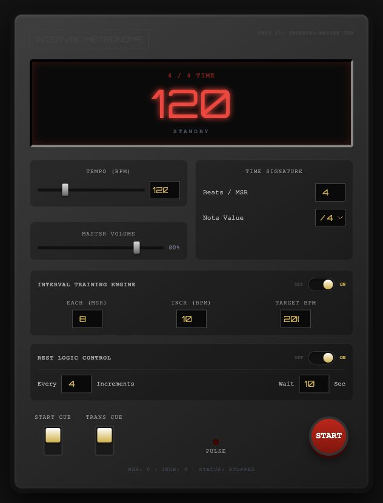
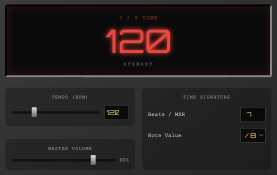
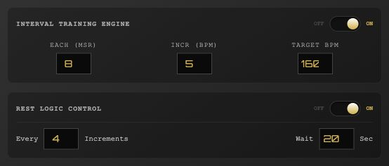

# Interval Metronome

**從穩定跟拍，到一步步加速。**

給吉他與樂器練習用的線上節拍器。設定自己的拍號、加速目標與休息時間，跟著語音預備拍開始練習。

**[▶ 開啟節拍器](https://bbcode1111.github.io/intervalmetronome/)**

免安裝 · 免登入 · 開啟瀏覽器即可使用

## 按照你的節奏練習

| 功能 | 可以怎麼用 |
| --- | --- |
| **30–400 BPM** | 用滑桿或直接輸入速度，從慢速拆解到快速練習。 |
| **自由輸入拍號** | 每小節拍數接受正整數，搭配四分或八分音符；預設為 4/4。 |
| **英文語音預備拍** | 跟著 one、two、three、four 進入節奏；開始與變速時的提示可分別開關。 |
| **自動逐步加速** | 設定每幾小節增加多少 BPM，達到目標後維持速度。 |
| **練習與休息交替** | 設定每加速幾次休息一次，以及休息秒數，結束後繼續練習。 |
| **音量與節拍燈** | 調整整體音量，搭配閃爍的 PULSE 燈掌握拍點。 |

## 三步開始

1. **設定速度與拍號**：調整 Tempo、Beats / MSR 與 Note Value。
2. **選擇練習方式**：固定速度練習時關閉 Interval Training Engine；需要循序加速時開啟並設定目標。
3. **按 START**：跟著預備拍進入練習，隨時按 STOP 停止。

## 自由拍號：輸入你需要的拍數

三拍、五拍、七拍都可以。**Beats / MSR** 直接輸入每小節拍數，**Note Value** 選擇 `/4` 或 `/8`。下圖示範 7/8；拍數只接受正整數，不接受小數。

  

BPM 以四分音符計算，因此同樣的 BPM 下，選擇 `/8` 時的拍點間隔是 `/4` 的一半。

## 讓節拍器陪你逐步加速

例如從 **120 BPM 練到 160 BPM**：每 **8 小節**加快 **5 BPM**，每加速 **4 次**休息 **20 秒**，休息後接著練。

  

| 面板設定 | 意思 |
| --- | --- |
| **Each (MSR)** | 每幾個練習小節加速一次。 |
| **Incr (BPM)** | 每次增加的速度。 |
| **Target BPM** | 想練到的目標速度。 |
| **Every … Increments** | 每加速幾次安排一次休息。 |
| **Wait … Sec** | 每次休息的秒數。 |

## 用預備拍接上節奏

- **START CUE**：開始練習與休息結束時，先播放一小節語音預備拍。
- **TRANS CUE**：速度提高後，用新速度報數，幫助你接上下一段。

語音報數配合當前拍號與速度，與每個拍點同步。休息時會提示「Rest」，面板顯示倒數時間與下一段速度。

> 練習時請讓頁面保持在前景、螢幕保持開啟。速度很快或拍數很大時，語音會變得緊湊；Master Volume 同時控制節拍與語音音量。

---

**[開始練習 →](https://bbcode1111.github.io/intervalmetronome/)** · [素材與授權](THIRD_PARTY_NOTICES.md)
